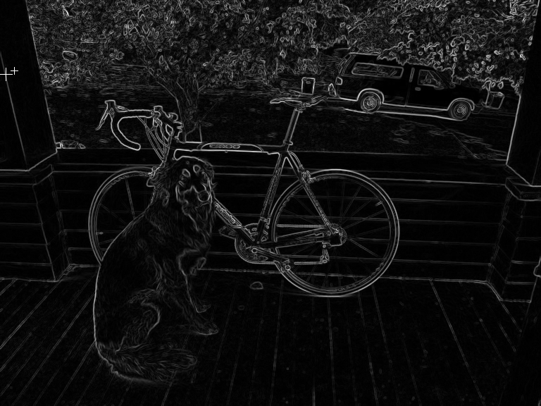
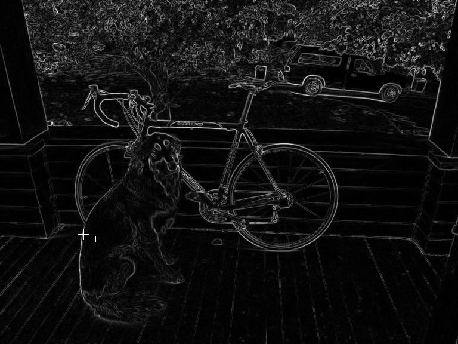
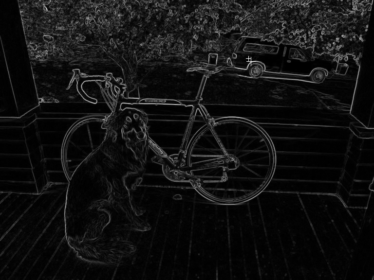

# distance-from-edge
Computer vision tool that finds the distance of a point from an edge using sobel edge detection and euclidean distance calculations.

For the caMicroscope GSoC 2021 Project Choice [2] Pathology Smartpens Code Challenge

**Code Challenge:** Create a page or tool which performs edge detection on a given image and, given a point, 
returns the distance from that point to the closest edge.

# Personal Background Knowledge
For background, I took the course CSE 455 Computer Vision at the University of Washington, 
and in this course I implemented my own miniature computer vision library. One of the
filters I implemented was the sobel operator for edge detection.

For this challenge, I added an additional function to my source code called `get_smallest_dist_from_edge`,
which you may find in `dist-from-edge/src/hw2/filter_image.c`

I added this additional `get_smallest_dist_from_edge` on March 14, 2021.

If you would like to play around with the code or run some tests yourself, you may clone the
repository, and (if you are using command line) cd into the repository and compile with `make`.

I generated the example images with `dist_from_edge.py`

# Test Images
Here is the image I used in my examples:

In the test images shown below, the sobel edge detection filter has been applied. The test points are denoted
with the smaller + and the closest edge detected is denoted with a larger cross.

## Test 1 (point on beam)

Test Point: (x: 20, y: 100) denoted by small +

Closest Distance: 13.000000

Best Edge: (x: 8, y: 105) denoted by large +

## Test 2 (point on dog)

Test Point: (x: 160, y: 400) denoted by small +

Closest Distance: 21.540659

Best Edge: (x: 140, y: 392) denoted by large +

## Test 3 (point on car)

Test Point: (x: 510, y: 120) denoted by small +

Closest Distance: 7.810250

Best Edge: (x: 515, y: 126) denoted by large +

